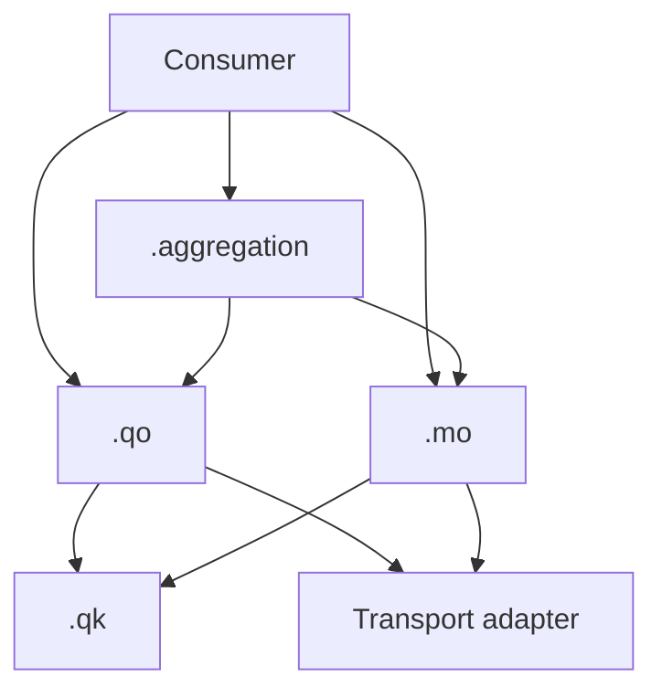

# Спецификация TanStack Query Kit

Версия спецификации: **1.1**. Статус: архитектурный контракт для внедрения.

Слова **обязательно**, **запрещено** и **допустимо** задают правила Kit. Это соглашения прикладной архитектуры, а не дополнительные ограничения самой библиотеки TanStack Query.

## 1. Назначение и границы

Kit организует сущностный слой кэширования серверного состояния. Кэш TanStack Query — источник истины для полученных серверных данных. Запрещено синхронизировать их копию в параллельном client-state хранилище. Черновик формы, локальный выбор и другое самостоятельное UI-состояние допустимы.

Kit не определяет HTTP-клиент, формат API, runtime-валидацию ответа, маршрутизацию, авторизацию, структуру репозитория или state manager. Transport adapter отвечает за сетевой запрос, преобразование ответа и ошибки; `.qo` и `.mo` могут его вызывать. Обратная зависимость transport → Query Kit запрещена.

Примеры рассчитаны на TypeScript со `strict: true` и TanStack Query v5 с `queryOptions`, `infiniteQueryOptions`, `mutationOptions`, `skipToken` и `MutationFunctionContext.client`. При внедрении нужно зафиксировать совместимую версию библиотеки и проверить типы на ней.

## 2. Модули и зависимости

| Модуль | Форма экспорта | Ответственность |
| --- | --- | --- |
| `<domain>.qk.ts` | Один namespace-объект `<domain>QK` | Ключи ресурса и их префиксы |
| `<domain>.qo.ts` | Отдельные `<domain><operation>QO` | `queryOptions` / `infiniteQueryOptions` |
| `<domain>.mo.ts` | Отдельные `<domain><operation>MO` | `mutationOptions` и полный cache-effect |
| `<scenario>.aggregation.ts` | Namespace-объект `<scenario>Aggregation` | Ссылки на QO/MO и чистая композиция |

Namespace здесь означает обычный `const`-объект, а не TypeScript `namespace`. `.qk`, `.qo`, `.mo`, `.aggregation` — виды файлов; `QK`, `QO`, `MO`, `Aggregation` — суффиксы экспортов.

Фабрики `.qk`, `.qo` и `.mo` принимают один объект с именованными полями, даже если параметр один. Фабрики без параметров вызываются без аргументов. Это правило относится к прикладным параметрам Kit; сигнатуры transport adapter и callback-контексты TanStack Query им не ограничиваются.

| Кто импортирует | Разрешённые зависимости внутри Query Kit |
| --- | --- |
| `.qk` | Нет |
| `.qo` | `.qk` |
| `.mo` | `.qk`, включая ключи других затронутых ресурсов |
| `.aggregation` | `.qo`, `.mo` |
| Consumer | `.qo`, `.mo`, `.aggregation` |
| Transport adapter | Нет |

Таблица ограничивает зависимости между модулями Kit. Импорты типов, transport-функций в `.qo`/`.mo` и чистых доменных функций в `.aggregation` допустимы. Публичные barrel-экспорты не должны позволять consumer обходить границу `.qk`.

Consumer — компонент, router loader, preloader или другой adapter жизненного цикла приложения. Агрегация необязательна: consumer может использовать QO и MO напрямую.



## 3. Query keys: `.qk.ts`

Ключи обязаны быть стабильными, иерархическими, сериализуемыми и возвращаться как readonly tuples через `as const`.

```ts
export const productQK = {
  all: () => ['product'] as const,
  lists: () => [...productQK.all(), 'list'] as const,
  list: (params: ProductListParams) => [...productQK.lists(), params] as const,
  details: () => [...productQK.all(), 'detail'] as const,
  detail: (params: { productId: string }) =>
    [...productQK.details(), params] as const,
} as const;
```

Параметры ресурса в query key обязаны быть объектами с именованными полями: `{ productId }`, а не позиционным `productId`. Статические сегменты иерархии (`'product'`, `'detail'`) остаются строками. Допустим единый объект `params` или отдельные объекты идентичности и фильтров:

```ts
// Альтернативная форма detail-ключа для ресурса с фильтрами.
detail: ({ productId, filterParams }: {
  productId: string;
  filterParams: { count: number; dateDiapason: DateDiapason };
}) => [...productQK.details(), { productId }, filterParams] as const,
```

Имена полей делают назначение параметров видимым в TanStack Query Devtools. Выбранная структура ключа должна быть единой для одной операции; альтернативные формы выше не используются одновременно для одного ресурса.

`.qk` принимает только готовые параметры ресурса. Обязательный ID не допускает `undefined`, `null` или фиктивные значения. Проверки готовности выполняются в `.qo` **до вызова** конкретного ключа; `.qk` не разрешает отсутствие ID и не проверяет существование записи на сервере. Валидный идентификатор описывает запрашиваемый ресурс, но не гарантирует успешный ответ. Отсутствие необязательного фильтра допустимо, если оно описывает реальный вариант запроса, например список без ограничения по городу.

В ключ входят все параметры, влияющие на результат: идентификатор, фильтры, сортировка, страница, локаль или область доступа, если от них зависит ресурс. Параметры нельзя менять после создания options. Нормализация параметров, если нужна, выполняется согласованно для ключа и запроса до передачи в `.qk`.

Обычный список и infinite query обязаны иметь разные ключи: их данные в кэше имеют разную структуру. Для infinite query курсор очередной страницы передаётся через `pageParam`; фильтры всей коллекции остаются в ключе.

В `.qk` запрещены transport-вызовы, `queryFn`, hooks, бизнес-логика и знание об UI. В production-коде `.qk` импортируется только в `.qo` и `.mo`; тесты ключей могут обращаться к нему напрямую.

Требования к сериализации и зависимости ключа от параметров согласуются с [Query Keys](https://tanstack.com/query/latest/docs/framework/react/guides/query-keys). Конкретная иерархия и запрет импорта из consumer — правила Kit.

### Доступ к ключу

`.qo` объявляет `queryKey` через `.qk`; `.mo` использует `.qk` для cache-effect. После создания options читать их `queryKey` допустимо только из callback-контекста TanStack Query, например `query.queryKey` в callback библиотеки.

Consumer запрещено:

- импортировать `.qk` или собирать ключ вручную;
- читать `productDetailQO({ productId: id }).queryKey`;
- принимать ключ отдельным аргументом для обхода границы;
- выполнять доменную invalidation после мутации.

Consumer передаёт options целиком: `useQuery(productDetailQO({ productId: id }))`, `queryClient.fetchQuery(productDetailQO({ productId: id }))`, `queryClient.ensureQueryData(productDetailQO({ productId: id }))`. API, которым требуется отдельный ключ для доменной записи в кэш, используется внутри `.mo`.

## 4. Query options: `.qo.ts`

Каждая фабрика экспортируется отдельно: `productDetailQO`, `productListQO`. Объект `productQO = { detail, list }` запрещён: отдельные экспорты не связывают операции заранее в один namespace.

Фабрика принимает параметры ресурса и возвращает результат стандартного `queryOptions` или `infiniteQueryOptions`. Собственная runtime-обёртка над ними не требуется. Это сохраняет [вывод типов options](https://tanstack.com/query/latest/docs/framework/react/guides/query-options).

Обязательные правила:

1. `queryFn` вызывает transport adapter и передаёт ему `signal`.
2. Готовность обязательных параметров проверяется до вызова конкретного ключа `.qk`. Если параметр отсутствует или невалиден, `.qo` использует префикс соответствующей ветки ключей и `skipToken`, не создавая ключ конкретного ресурса.
3. `enabled` принадлежит consumer и запрещён в `.qo`.
4. Фабрика не принимает произвольные TanStack overrides. Consumer добавляет настройки наблюдателя через spread.
5. Consumer не подменяет `queryKey`, `queryFn` и контракт пагинации. Изменение идентичности или способа загрузки требует отдельной QO.
6. `select` в `.qo` допустим только как общий контракт представления ресурса. Преобразование для одного экрана остаётся в consumer.
7. `staleTime` и `gcTime` выбираются по свойствам ресурса. Их нельзя увеличивать только для сокрытия случайных повторных запросов.

```ts
export const productDetailQO = ({ productId }: { productId: string | undefined }) => {
  const isReady = productId !== undefined && productId !== '';

  return queryOptions({
    queryKey: isReady ? productQK.detail({ productId }) : productQK.details(),
    queryFn: isReady
      ? ({ signal }) => getProduct(productId, { signal })
      : skipToken,
  });
};
```

При отсутствии ID `details()` используется только как ключ заблокированного наблюдателя. Под этим префиксом не загружают и не записывают данные ресурса; сам префикс также остаётся фильтром для cache-effect. После появления валидного ID `.qo` создаёт конкретный detail-ключ.

Проверка готовности зависит от типа параметра: для числового ID значение `0` может быть валидным. Non-null assertion и подстановка `''` или `0` вместо отсутствующего ID не заменяют guard.

`skipToken` — техническая блокировка, `enabled` — решение consumer о запуске. Они не взаимозаменяемы. Ручной `refetch()` не запускает запрос с `skipToken`; см. [Disabling Queries](https://tanstack.com/query/latest/docs/framework/react/guides/disabling-queries).

Для `fetchQuery` / `ensureQueryData` / предзагрузки consumer сначала получает валидные параметры. `enabled` не является механизмом защиты императивного API. Suspense-consumer требует options с гарантированным `queryFn`: если QO допускает `skipToken`, для обязательных параметров нужна типобезопасная перегрузка или отдельная фабрика.

`select` изменяет результат наблюдателя, а не данные в кэше. Преобразование, которое должно менять именно хранимую форму данных, выполняется до возврата результата `queryFn`. Один ключ не может обозначать несовместимые формы данных.

### Infinite queries

Фабрика использует `infiniteQueryOptions`, отдельную ветку ключей, явные `initialPageParam` и `getNextPageParam`. Transport получает `pageParam` и `signal`. Consumer вызывает `useInfiniteQuery` и управляет UI загрузки следующей страницы. Параметры страницы и фильтры не дублируются в локальном кэше.

## 5. Mutation options: `.mo.ts`

Каждая фабрика экспортируется отдельно: `productRenameMO`, `productCreateMO`. Namespace `productMO = { ... }` и пустые `.mo.ts` запрещены.

Прикладные variables `mutationFn` обязаны быть одним объектом с именованными полями, даже для одного значения: `({ productId }: { productId: string })`, а не `(productId: string)`. Контекст TanStack Query — отдельный аргумент библиотеки, он не является частью variables.

`.mo` владеет **всем cache-effect** операции: invalidation, `setQueryData`, removal, refetch, optimistic update и rollback. Это включает затронутые ресурсы других доменов. Consumer не дополняет и не переопределяет этот эффект.

### Статический план

Статические зависимости задаются типизированным `meta.invalidates`:

```ts
export const productCreateMO = () =>
  mutationOptions({
    mutationFn: (variables: CreateProductRequest) => createProduct(variables),
    meta: { invalidates: [productQK.lists()] },
  });
```

`meta.invalidates` — соглашение Kit, а не встроенное поведение TanStack Query. Инфраструктура обязана зарегистрировать meta-тип и установить универсальный `MutationCache`, который после успешной мутации выполняет план и возвращает Promise. Без исполнителя поле ничего не инвалидирует. Полный пример — в [каталоге](examples/catalog.md).

Исполнитель не импортирует доменные keys и не содержит условий по названиям операций. В базовом контракте элементы плана — префиксы ключей; invalidation использует стандартное частичное сопоставление. Если нужны динамический ключ, точное совпадение или другая политика refetch, их задаёт callback `.mo`.

### Динамический эффект

Эффект, зависящий от ответа или variables, находится в callback фабрики. Клиент берётся из `MutationFunctionContext.client`, а не из глобального singleton:

```ts
export const productRenameMO = () =>
  mutationOptions({
    mutationFn: (variables: RenameProductRequest) => renameProduct(variables),
    onSuccess: async (product, variables, _onMutateResult, { client }) => {
      client.setQueryData(productQK.detail({ productId: variables.productId }), product);
      await client.invalidateQueries({ queryKey: productQK.lists() });
    },
  });
```

В примере сервер возвращает полный `Product`, совместимый с detail-кэшем. Частичный ответ нельзя записывать как полный ресурс: нужен корректный merge или invalidation. Изменённое поле может влиять на сортировку и членство в списке, поэтому обновления только detail-кэша недостаточно.

Обязательный cache-effect возвращает Promise. Success lifecycle ожидает выбранную политику согласования кэша. Invalidation сама по себе не гарантирует повторную загрузку всех записей: по умолчанию перезапрашиваются активные queries, неактивные помечаются устаревшими. Политику ошибок refetch и необходимость `throwOnError` задаёт приложение явно.

Один эффект не дублируется одновременно в `meta.invalidates` и локальном callback. Если важен порядок записи и invalidation, зависимые действия выполняются последовательно в одном callback `.mo`.

### Optimistic update

При необходимости оптимистического изменения весь цикл находится в `.mo`: отмена конкурирующих запросов, снимок данных, иммутабельное обновление, rollback при ошибке и итоговое согласование. Нужно определить поведение для отсутствующей записи и параллельных мутаций. Откат старого снимка не должен затирать более новую успешную операцию.

UI-effects передаются в callbacks конкретного `mutate(variables, { onSuccess, onError })`: уведомление, навигация, закрытие окна, локальная аналитика. Они не содержат обязательной логики кэша: observer может размонтироваться. Consumer не перезаписывает callbacks, возвращённые MO. `mutateAsync` используется, только если consumer действительно нужен Promise.

## 6. Aggregation: `.aggregation.ts`

`<scenario>Aggregation` — namespace-объект со ссылками на QO/MO и чистыми функциями. Он объединяет запросы, мутации и доменные функции конкретного сценария. Сочетание операций, мапперы и бизнес-guards могут иметь смысл только в этом сценарии; повторное использование в других сценариях не обязательно. Ресурсные QO/MO остаются самостоятельными, а специфичные для сценария мапперы, бизнес-guards и набор операций находятся в `.aggregation`.

Например, сценарий может требовать последовательность «получить данные → преобразовать результат маппером → передать его в мутацию». Агрегация объединяет нужные QO/MO, мапперы результата и variables, а consumer сам определяет последовательность и исполняет шаги, передавая результат предыдущего шага следующему. Агрегация не задаёт порядок операций; разные consumers могут использовать её операции и функции в разных последовательностях. Такие мапперы могут оставаться локальными для `.aggregation`, если вне сценария они не нужны.

Допустимы ссылки на QO и MO, mappers, normalizers, selectors, resolvers, бизнес-guards и инварианты. Если адаптация не нужна, фабрика передаётся по ссылке:

```ts
export const productPageAggregation = {
  productQO: productDetailQO,
  categoryQO: categoryDetailQO,
  renameProductMO: productRenameMO,
  shouldQueryCategory: (product: Product | undefined) =>
    product?.status === 'published' && product.categoryId !== undefined,
  toView: toProductPageView,
} as const;
```

Запрещены hooks, transport-вызовы, новые `queryFn` и `mutationFn`, `QueryClient`, side effects, `enabled`, владение ключами и повторение технических `skipToken`-guards. Pass-through wrapper вокруг неизменённой QO или MO не нужен. Ссылка на MO сохраняет её callbacks и полный cache-effect; агрегация не дополняет и не переопределяет этот эффект.

Технический guard находится в `.qo`; бизнес-guard — в `.aggregation`; применение через `enabled` — в consumer. Aggregation не исполняет запросы или мутации и не определяет framework lifecycle. Хуки, которые инкапсулируют такую агрегацию, запрещены: переиспользуется сам объект `Aggregation`.

## 7. Consumer и lifecycle

Consumer использует QO/MO/Aggregation напрямую. Hook, который только проксирует фабрику, запрещён.

Consumer владеет hooks, `enabled`, преобразованием `select` для экрана, UI-errors и UI-effects. Для динамической коллекции consumer передаёт QO в `useQueries`; hooks нельзя вызывать в цикле. Независимые загрузки можно запускать параллельно; зависимый запрос получает параметры из результата предыдущего.

Router loader и preloader находятся вне Kit. Они используют те же QO, что и UI. Выбор `fetchQuery`, `prefetchQuery`, `ensureQueryData`, ожидания и политики свежести относится к конкретному lifecycle: эти методы имеют разную семантику ошибок и повторной загрузки.

Для SSR создаётся отдельный `QueryClient` на серверный request; общий серверный singleton запрещён. Все consumers одного request используют один request-scoped client. В браузере экземпляр клиента стабилен. Dehydration/hydration, безопасная сериализация и обработка ошибок относятся к framework adapter.

## 8. Инфраструктура кэша

- `staleTime` регулирует свежесть; `gcTime` — время хранения неиспользуемого кэша. Kit требует `gcTime >= staleTime`; это выбранное соглашение, а не проверка TanStack Query.
- Для визуальной заглушки используется `placeholderData`.
- `initialData` содержит только реальные данные совместимой формы вместе с корректным `initialDataUpdatedAt`.
- `MutationCache` исполняет планы `.mo` без знания о доменах.
- При смене пользователя или области доступа инфраструктура изолирует либо очищает соответствующий кэш. Секреты и access tokens не входят в keys.
- Настройки retry, persistence и обработки ошибок определяются приложением с учётом поведения transport.

## 9. Критерий соответствия

Реализация соответствует Kit, когда соблюдает границы модулей, сохраняет единственную идентичность каждого ресурса и выполняет полный cache-effect мутации независимо от наличия UI-наблюдателя. Проверяемые сценарии приведены в [руководстве внедрения](ADOPTION.md).
