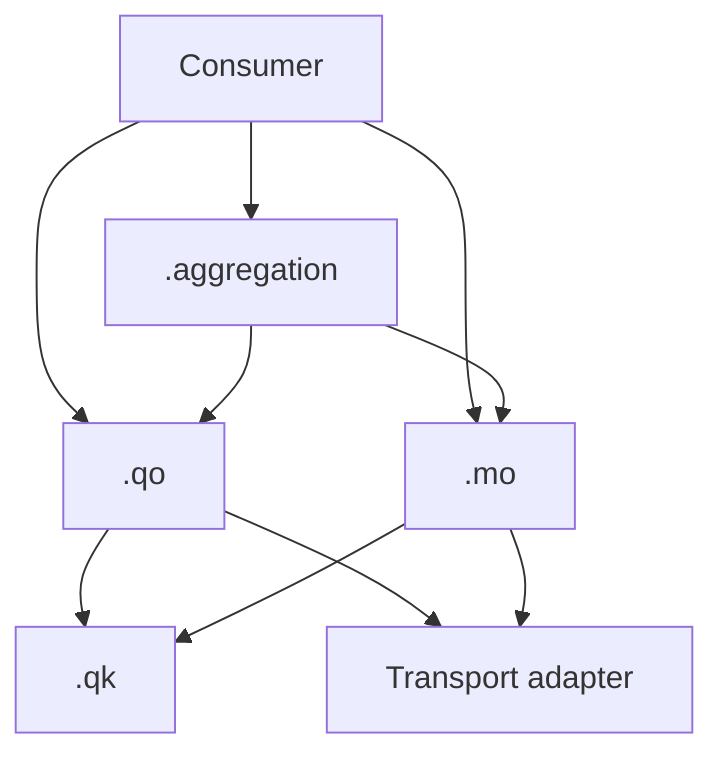

# Спецификация TanStack Query Kit

Версия спецификации: **1.3**. Статус: архитектурный контракт для внедрения.

Слова **обязательно**, **запрещено** и **допустимо** задают правила Kit. Это соглашения прикладной архитектуры, а не дополнительные ограничения самой библиотеки TanStack Query.

## 1. Назначение и границы

Kit организует сущностный слой кэширования серверного состояния. Сервер владеет исходными данными; Query cache владеет их полученным представлением на клиенте. Запрещён независимо изменяемый дублирующий кэш того же ресурса со своей свежестью и invalidation. Производная проекция observer result без самостоятельного владения данными допустима, как и черновик формы, локальный выбор и состояние сценария.

Kit не определяет HTTP-клиент, формат API, runtime-валидацию ответа, маршрутизацию, авторизацию, структуру репозитория или state manager. Transport adapter отвечает за сетевой запрос, преобразование ответа и ошибки; `.qo` и `.mo` могут его вызывать. Обратная зависимость transport → Query Kit запрещена.

Kit рассчитан на TypeScript со `strict: true` и TanStack Query v5. При внедрении фиксируются совместимые версии и проверяется API выбранного адаптера. Конкретные методы, регистрация типов и framework lifecycle описаны в [stack/](stack/README.md); применяются только материалы используемых технологий. React, роутер, SSR, Suspense и дополнительный state manager не являются предпосылками Kit.

## 2. Модули и зависимости

| Модуль | Форма экспорта | Ответственность |
| --- | --- | --- |
| `<domain>.qk.ts` | Один namespace-объект `<domain>QK` | Ключи ресурса и их префиксы |
| `<domain>.qo.ts` | Отдельные `<domain><operation>QO` | `queryOptions` / `infiniteQueryOptions` |
| `<domain>.mo.ts` | Отдельные `<domain><operation>MO` | `mutationOptions` и полный cache-effect |
| `<scenario>.aggregation.ts` | Namespace-объект `<scenario>Aggregation` | Ссылки на QO/MO и чистая композиция |

Namespace здесь означает обычный `const`-объект, а не TypeScript `namespace`. `.qk`, `.qo`, `.mo`, `.aggregation` — виды файлов; `QK`, `QO`, `MO`, `Aggregation` — суффиксы экспортов.

Фабрики `.qk`, `.qo` и `.mo` принимают один объект с именованными полями, даже если параметр один. Фабрики без параметров вызываются без аргументов. Это правило относится к прикладным параметрам Kit; сигнатуры transport adapter и callback-контексты TanStack Query им не ограничиваются.

Максимально полагаемся на inference во всём слое Kit и местах его потребления. Явные типы задают входные и внешние контракты либо дополняют контекст, который TypeScript не может вывести. Типы, уже выведенные из источника данных или преобразования, не дублируются на промежуточных слоях и в consumers.

Возвращаемый тип фабрик QO/MO не аннотируется. `queryOptions`, `infiniteQueryOptions` и `mutationOptions` вызываются без явных generic-аргументов: `queryOptions<Product>(...)` и аналогичные формы не используются. Данные выводятся из результата transport в `queryFn` / `mutationFn`, представление — из результата `select`, ключ — из QK, variables — из типизированных входных параметров. Контракт ошибки задаётся регистрацией выбранного адаптера. Типы параметров фабрик, variables и callback-контекста можно указывать; дублировать выходной контракт фабрики или скрывать несовместимость через casts нельзя.

| Кто импортирует | Разрешённые зависимости внутри Query Kit |
| --- | --- |
| `.qk` | Нет |
| `.qo` | `.qk` |
| `.mo` | `.qk`, включая ключи других затронутых ресурсов |
| `.aggregation` | `.qo`, `.mo` |
| Consumer | `.qo`, `.mo`, `.aggregation` |
| Transport adapter | Нет |

Таблица ограничивает зависимости между модулями Kit. Импорты типов, transport-функций в `.qo`/`.mo` и чистых доменных функций в `.aggregation` допустимы. Публичные barrel-экспорты не должны позволять consumer обходить границу `.qk`.

Consumer — компонент, router loader, preloader или другой adapter жизненного цикла приложения. Агрегация необязательна: consumer может использовать QO и MO напрямую.



## 3. Query keys: `.qk.ts`

Ключи обязаны быть стабильными, иерархическими, сериализуемыми и возвращаться как readonly tuples через `as const`.

```ts
export const productQK = {
  all: () => ['product'] as const,
  lists: () => [...productQK.all(), 'list'] as const,
  list: (params: ProductListParams) => [...productQK.lists(), params] as const,
  details: () => [...productQK.all(), 'detail'] as const,
  unavailableDetail: () => [...productQK.all(), 'unavailable', 'detail'] as const,
  detail: (params: { productId: string }) =>
    [...productQK.details(), params] as const,
} as const;
```

Параметры ресурса в query key обязаны быть объектами с именованными полями: `{ productId }`, а не позиционным `productId`. Статические сегменты иерархии (`'product'`, `'detail'`) остаются строками. Допустим единый объект `params` или отдельные объекты идентичности и фильтров:

```ts
// Альтернативная форма detail-ключа для ресурса с фильтрами.
detail: ({ productId, filterParams }: {
  productId: string;
  filterParams: { count: number; dateDiapason: DateDiapason };
}) => [...productQK.details(), { productId }, filterParams] as const,
```

Имена полей делают назначение параметров видимым в TanStack Query Devtools. Выбранная структура ключа должна быть единой для одной операции; альтернативные формы выше не используются одновременно для одного ресурса.

Фабрики ключей конкретного ресурса в `.qk` принимают только готовые параметры. Обязательный ID не допускает `undefined`, `null` или фиктивные значения. Если QO допускает неготовые параметры, проверки выполняются в `.qo` **до вызова** конкретного ключа; `.qk` не разрешает отсутствие ID и не проверяет существование записи на сервере. Валидный идентификатор описывает запрашиваемый ресурс, но не гарантирует успешный ответ. Отсутствие необязательного фильтра допустимо, если оно описывает реальный вариант запроса, например список без ограничения по городу.

Для операции, допускающей отсутствие обязательных параметров в `.qo`, `.qk` также объявляет отдельный технический ключ `unavailable<Operation>()`, например `unavailableDetail()`. Он не принимает параметры ресурса и не содержит фиктивных ID. Технические ключи располагаются в отдельной ветке: `['product', 'unavailable', 'detail']`, вне `details()`. Префикс `details()` выбирает только конкретные detail-записи; общий `all()` охватывает и ресурсные, и технические ключи. `unavailable` — зарезервированный статический сегмент Kit. Разные операции используют разные технические ключи; добавлять их для фабрик, которым всегда передают готовые параметры, не требуется.

В ключ входят все параметры, влияющие на результат: идентификатор, фильтры, сортировка, страница, локаль или область доступа, если от них зависит ресурс. Параметры нельзя менять после создания options. Нормализация параметров, если нужна, выполняется согласованно для ключа и запроса до передачи в `.qk`.

Обычный список и infinite query обязаны иметь разные ключи: их данные в кэше имеют разную структуру. Для infinite query курсор очередной страницы передаётся через `pageParam`; фильтры всей коллекции остаются в ключе.

В `.qk` запрещены transport-вызовы, `queryFn`, hooks, бизнес-логика и знание об UI. В production-коде `.qk` импортируется только в `.qo` и `.mo`; проверочный код вне production может обращаться к нему напрямую.

Требования к сериализации и зависимости ключа от параметров согласуются с [Query Keys](https://tanstack.com/query/latest/docs/framework/react/guides/query-keys). Конкретная иерархия и запрет импорта из consumer — правила Kit.

### Доступ к ключу

`.qo` объявляет `queryKey` через `.qk`; `.mo` использует `.qk` для cache-effect. После создания options читать их `queryKey` допустимо только из callback-контекста TanStack Query, например `query.queryKey` в callback библиотеки.

Consumer запрещено:

- импортировать `.qk` или собирать ключ вручную;
- читать `productDetailQO({ productId: id }).queryKey`;
- принимать ключ отдельным аргументом для обхода границы;
- выполнять доменную invalidation после мутации.

Consumer передаёт options целиком в API выбранного адаптера для наблюдения или императивного выполнения запроса. API, которым требуется отдельный ключ для доменной записи в кэш, используется внутри `.mo`.

QK отделена для иерархии и cache-effects MO; consumer получает ключ и функцию вместе в QO. Запрет извлекать ключ ограничивает обход ресурсного контракта. Цена этого решения и проверка типов cache-effects описаны в [TanStack Query](stack/tanstack-query/README.md#ключи-и-типы-данных).

## 4. Query options: `.qo.ts`

Каждая фабрика экспортируется отдельно: `productDetailQO`, `productListQO`. Объект `productQO = { detail, list }` запрещён: отдельные экспорты не связывают операции заранее в один namespace.

Фабрика принимает параметры ресурса и возвращает результат стандартного `queryOptions` или `infiniteQueryOptions`. Типы выводятся по общему правилу фабрик из раздела 2. Собственная runtime-обёртка над ними не требуется. Это сохраняет [вывод типов options](https://tanstack.com/query/latest/docs/framework/react/guides/query-options).

Options читаются как конфигурация операции. Совпадение полей само по себе не является основанием для выделения общих `Parts` или `Policy`: полные конфиги могут повторять значения. Переиспользование выделяется при самостоятельном смысле общего контракта, а не ради устранения небольшого дублирования.

Обязательные правила:

1. `queryFn` вызывает transport adapter и передаёт ему `signal`.
2. QO, допускающая неготовые параметры, проверяет их до вызова конкретного ключа `.qk`. Если параметр отсутствует или невалиден, она использует отдельный технический ключ `unavailable<Operation>()` и `skipToken`, не создавая ключ конкретного ресурса. Эта ветка обязательно оформляется как early return; ниже возвращаются options готового запроса. Тернарные проверки готовности внутри `queryKey` и `queryFn` не используются.
3. `enabled` принадлежит consumer и запрещён в `.qo`.
4. Фабрика не принимает произвольные TanStack overrides. Consumer добавляет настройки наблюдателя через spread.
5. Consumer не подменяет `queryKey`, `queryFn` и контракт пагинации. Изменение идентичности или способа загрузки требует отдельной QO.
6. `select` в `.qo` допустим только как общий контракт представления ресурса. Преобразование для одного экрана остаётся в consumer.
7. `staleTime` и `gcTime` выбираются по свойствам ресурса. Их нельзя увеличивать только для сокрытия случайных повторных запросов.

Обе ветки early return имеют один тип данных ресурса и совместимые типы options. Их типизация сохраняет контракт ошибки приложения и совместимость с используемыми consumers. Реализация и проверяемый пример находятся в материалах [выбранного стека](stack/README.md).

При отсутствии ID `.qo` использует `unavailableDetail()` только как ключ заблокированного наблюдателя с `skipToken`. Он обозначает техническое состояние операции, а не категорию, товар или коллекцию. Под этим ключом не загружают и не записывают данные ресурса. После появления валидного ID `.qo` создаёт конкретный detail-ключ.

Проверка готовности зависит от типа параметра: для числового ID значение `0` может быть валидным. Non-null assertion и подстановка `''` или `0` вместо отсутствующего ID не заменяют guard.

`skipToken` — техническая блокировка, `enabled` — решение consumer о запуске. Они не взаимозаменяемы. Ручной `refetch()` не запускает запрос с `skipToken`; см. [Disabling Queries](https://tanstack.com/query/latest/docs/framework/react/guides/disabling-queries).

Для императивного выполнения и предзагрузки consumer сначала получает валидные параметры и исполняемый `queryFn`. `enabled` не является механизмом защиты императивного API. Consumer, которому нужен гарантированно готовый запрос, использует отдельную QO с той же идентичностью ресурса. Такая QO принимает подготовленные параметры и не повторяет guard: проверка внешнего ввода выполняется до её вызова. Тип `string` гарантирует отсутствие `undefined`, но валидность его значения определяется входным контрактом.

`select` преобразует результат consumer без изменения данных в кэше. Преобразование, которое должно менять именно хранимую форму данных, выполняется до возврата результата `queryFn`. Один ключ не может обозначать несовместимые формы данных.

### Infinite queries

Фабрика использует `infiniteQueryOptions`, отдельную ветку ключей, явные `initialPageParam` и `getNextPageParam`. Transport получает `pageParam` и `signal`. Consumer использует API пагинации выбранного адаптера и управляет загрузкой следующей страницы. Параметры страницы и фильтры не дублируются в локальном кэше.

## 5. Mutation options: `.mo.ts`

Каждая фабрика экспортируется отдельно: `productRenameMO`, `productCreateMO`. Namespace `productMO = { ... }` и пустые `.mo.ts` запрещены.

Прикладные variables `mutationFn` обязаны быть одним объектом с именованными полями, даже для одного значения: `({ productId }: { productId: string })`, а не `(productId: string)`. Контекст TanStack Query — отдельный аргумент библиотеки, он не является частью variables.

`.mo` владеет **всем cache-effect** операции: invalidation, `setQueryData`, removal, refetch, optimistic update и rollback. Это включает затронутые ресурсы других доменов. Consumer не дополняет и не переопределяет этот эффект.

### Статический план

Статические зависимости задаются типизированным `meta.invalidates`:

```ts
export const productCreateMO = () =>
  mutationOptions({
    mutationFn: (variables: CreateProductRequest) => createProduct(variables),
    meta: { invalidates: [productQK.lists()] },
  });
```

`meta.invalidates` — соглашение Kit, а не встроенное поведение TanStack Query. Инфраструктура обязана зарегистрировать meta-тип и установить универсальный `MutationCache`, который после успешной мутации выполняет план и возвращает Promise. Без исполнителя поле ничего не инвалидирует. Подключение и примеры выбираются по [материалу адаптера](stack/README.md).

Исполнитель не импортирует доменные keys и не содержит условий по названиям операций. В базовом контракте элементы плана — префиксы ключей; invalidation использует стандартное частичное сопоставление. Исполнитель сопоставляет весь план в одном вызове invalidation: пересечение префиксов не перезапускает одну query несколько раз. Пустой план ничего не инвалидирует. Если нужны динамический ключ, точное совпадение или другая политика refetch, их задаёт callback `.mo`.

### Динамический эффект

Эффект, зависящий от ответа или variables, находится в callback фабрики. Клиент берётся из `MutationFunctionContext.client`, а не из глобального singleton:

```ts
export const productRenameMO = () =>
  mutationOptions({
    mutationFn: (variables: RenameProductRequest) => renameProduct(variables),
    onSuccess: async (product, variables, _onMutateResult, { client }) => {
      client.setQueryData(productQK.detail({ productId: variables.productId }), product);
      await client.invalidateQueries({ queryKey: productQK.lists() });
    },
  });
```

В примере сервер возвращает полный `Product`, совместимый с detail-кэшем. Частичный ответ нельзя записывать как полный ресурс: нужен корректный merge или invalidation. Изменённое поле может влиять на сортировку и членство в списке, поэтому обновления только detail-кэша недостаточно.

Синхронные cache-effects выполняются непосредственно; Promise обязательных асинхронных эффектов возвращаются или ожидаются callback. Success lifecycle ожидает выбранную политику согласования кэша. Invalidation сама по себе не гарантирует повторную загрузку всех записей: по умолчанию перезапрашиваются активные queries, неактивные помечаются устаревшими. Политику ошибок refetch и необходимость `throwOnError` задаёт приложение явно.

Один эффект не дублируется одновременно в `meta.invalidates` и локальном callback. Если важен порядок записи и invalidation, зависимые действия выполняются последовательно в одном callback `.mo`.

### Optimistic update

При необходимости оптимистического изменения весь цикл находится в `.mo`: отмена конкурирующих запросов, снимок данных, иммутабельное обновление, rollback по контракту отказа и итоговое согласование. Нужно определить поведение для отсутствующей записи и параллельных мутаций. Откат старого снимка и refetch завершившейся мутации не должны затирать более новую операцию. Одной отмены queries недостаточно: MO определяет область связанных записей и момент итогового согласования. Отказ команды и отказ cache-effect различаются по [контракту восстановления](#повторы-и-результат-записи).

Если требуется лишь временное представление ожидаемой записи, consumer может строить его из variables и pending-состояния мутации без изменения кэша. Такой UI не требует cache rollback; подтверждённые изменения ресурса по-прежнему согласует MO.

UI-effects передаются в callbacks конкретного `mutate(variables, { onSuccess, onError })`: уведомление, навигация, закрытие окна, локальная аналитика. Они не содержат обязательной логики кэша: observer может размонтироваться. Consumer не перезаписывает callbacks, возвращённые MO. `mutateAsync` используется, только если consumer действительно нужен Promise.

## 6. Aggregation: `.aggregation.ts`

`<scenario>Aggregation` — namespace-объект со ссылками на QO/MO и чистыми функциями. Он объединяет запросы, мутации и доменные функции конкретного сценария. Сочетание операций, мапперы и бизнес-guards могут иметь смысл только в этом сценарии; повторное использование в других сценариях не обязательно. Ресурсные QO/MO остаются самостоятельными. При выделенной Aggregation специфичные для сценария мапперы, бизнес-guards и набор операций находятся в ней; без Aggregation чистые сценарные функции остаются рядом с consumer. Создавать агрегацию ради одного guard не требуется.

Например, сценарий может требовать последовательность «получить данные → преобразовать результат маппером → передать его в мутацию». Агрегация объединяет нужные QO/MO, мапперы результата и variables, а consumer сам определяет последовательность и исполняет шаги, передавая результат предыдущего шага следующему. Агрегация не задаёт порядок операций; разные consumers могут использовать её операции и функции в разных последовательностях. Такие мапперы могут оставаться локальными для `.aggregation`, если вне сценария они не нужны.

Допустимы ссылки на QO и MO, mappers, normalizers, selectors, resolvers, бизнес-guards и инварианты. Если адаптация не нужна, фабрика передаётся по ссылке:

```ts
export const productPageAggregation = {
  productQO: productDetailQO,
  categoryQO: categoryDetailQO,
  renameProductMO: productRenameMO,
  shouldQueryCategory: (product: Product | undefined) =>
    product?.status === 'published',
  toView: toProductPageView,
} as const;
```

Запрещены hooks, transport-вызовы, новые `queryFn` и `mutationFn`, `QueryClient`, side effects, `enabled`, владение ключами и повторение технических `skipToken`-guards. Pass-through wrapper вокруг неизменённой QO или MO не нужен. Ссылка на MO сохраняет её callbacks и полный cache-effect; агрегация не дополняет и не переопределяет этот эффект.

Технический guard находится в `.qo`; бизнес-guard — в чистой сценарной функции; применение через `enabled` и показ связанных данных и состояний — в consumer. Aggregation не исполняет запросы или мутации и не определяет framework lifecycle. Хуки, которые инкапсулируют такую агрегацию, запрещены: переиспользуется сам объект `Aggregation`. Так набор операций остаётся доступен разным consumers без заранее выбранной подписки и последовательности.

## 7. Consumer и lifecycle

Consumer использует QO/MO/Aggregation напрямую. Hook, который только проксирует фабрику, запрещён. Содержательный consumer-hook для UI-lifecycle допустим поверх QO/MO, если не превращает Aggregation в скрытый исполнитель сценария. Предпочтение options соответствует [TkDodo — Creating Query Abstractions](https://tkdodo.eu/blog/creating-query-abstractions); запрет инкапсулировать Aggregation — отдельное решение Kit.

Consumer владеет подпиской на данные, активностью запроса, преобразованием результата для экрана, UI-errors и UI-effects. Динамические коллекции используют механизм подписки выбранного адаптера с соблюдением его lifecycle. Независимые загрузки можно запускать параллельно; зависимый запрос получает параметры из результата предыдущего.

Загрузчик, предзагрузка и компонент используют один контракт QO. Consumer выбирает ожидание, свежесть и обработку отклонённого Promise; конкретный императивный API описан в [TanStack Query](stack/tanstack-query/README.md#императивное-выполнение).

### Общие принципы SSR

Этот раздел применяется, если приложение использует серверный рендеринг. SSR добавляет серверный consumer и передачу состояния в браузер, сохраняя границы QK/QO/MO/Aggregation. Общие правила не требуют конкретного роутера, UI-framework или streaming.

| Принцип | Правило Kit | Обоснование |
| --- | --- | --- |
| Изоляция | Серверный QueryClient и кеш принадлежат request; общий процессный singleton запрещён | Разные requests могут иметь разные права, параметры и данные. Общий кеш смешивает эти контексты |
| Стабильность в браузере | Клиент сохраняется в пределах жизненного цикла приложения; смена области доступа обрабатывается явно | Пересоздание клиента при каждом рендере теряет кеш и подписки |
| Единая идентичность | Серверное и клиентское чтение одного ресурса используют одинаковые параметры ключа и совместимую форму данных | Среда выполнения сама по себе не создаёт другой ресурс; разные ключи разрывают продолжение чтения после SSR |
| Перенос состояния | В браузер передаются разрешённые данные и сведения об их свежести; сериализация и восстановление согласованы | HTML и первый клиентский рендер должны использовать согласованное состояние, а кеш — корректно оценивать возраст данных |
| Свежесть | Возраст данных считается от получения на сервере, а не от момента восстановления в браузере | Hydration не делает старые данные новыми и не отменяет ресурсную политику refetch |
| Владение lifecycle | Создание клиента, ожидание загрузок, перенос состояния, подписки и освобождение ресурсов принадлежат adapter | QO/MO описывают ресурс и операцию, а не порядок серверного рендера и восстановления приложения |

В одной области серверного выполнения consumers используют согласованный кеш. Если framework разделяет предзагрузку и рендер на разные экземпляры клиента, adapter явно переносит состояние между ними. Сервер и браузер не разделяют живой экземпляр QueryClient: переносится состояние, а не клиент, callbacks или подписки. Основание для изоляции и передачи кеша — [Server Rendering & Hydration](https://tanstack.com/query/latest/docs/framework/react/guides/ssr).

**Серверная загрузка.** Consumer определяет, какие данные необходимы для основного содержимого и результата запроса страницы, и ожидает их до соответствующего рендера. Независимые загрузки можно выполнять параллельно; второстепенные данные могут иметь отдельный lifecycle, если framework его поддерживает. Каждый запущенный Promise имеет обработку отказа; ошибка не превращается в успешное пустое состояние. Императивная предзагрузка сама по себе не создаёт долгоживущую подписку.

**Граница передачи.** Adapter выбирает состав payload и безопасный способ его включения в ответ. В него не попадают credentials, серверные секреты, внутренние stack traces и данные, недоступные получателю. Совпадение TypeScript-типов не гарантирует сохранение значений или prototype при сериализации: восстановленные данные и доступная клиенту форма ошибок должны соответствовать контракту приложения. Общий кеш HTML или серверного framework также учитывает область доступа; изоляция QueryClient не изолирует остальные кеши автоматически.

**Hydration и дальнейшие изменения.** Передача кеша позволяет браузеру продолжить работу с полученным ресурсом, но не гарантирует отсутствие refetch: он зависит от возраста данных и политики consumer. Не нужно увеличивать `staleTime` только для сокрытия повторной загрузки. Серверный результат страницы и браузерный кеш после передачи имеют разные lifecycle; мутация браузерного кеша сама по себе не обновляет ранее сформированный серверный результат. Если ресурс представлен в обоих lifecycle, adapter определяет их согласование. Варианты этих границ обсуждаются в [Advanced Server Rendering](https://tanstack.com/query/latest/docs/framework/react/guides/advanced-ssr).

Конкретные API создания клиента, dehydration/hydration, streaming и обработки ошибок раскрываются в [stack/](stack/README.md). Спецификация определяет, что должно сохраняться между средами; материал framework — как это обеспечить.

## 8. Ошибки и восстановление

### Контракт и типы

Transport adapter обязан отклонить Promise или выбросить ошибку при неуспешной операции, включая HTTP-ошибку и ошибку валидации ответа. `.qo` и `.mo` не превращают ошибку в успешные пустые данные. Проверка `response.ok` для `fetch` принадлежит transport. См. [Query Functions](https://tanstack.com/query/latest/docs/framework/react/guides/query-functions).

Приложение определяет форму ошибки и чистые функции её распознавания. Типы QO/MO сохраняют этот контракт; конкретная регистрация описана в [TanStack Query](stack/tanstack-query/README.md#типизация-ошибок). Типизация не заменяет проверку и нормализацию ошибки в runtime.

Источник и смысл ошибки различаются: backend может вернуть технический сбой или бизнес-отказ. HTTP-статус сам по себе не определяет способ восстановления. Транспортные сбои, сервисные сбои, ожидаемые бизнес-отказы и ошибки программы распознаются согласно контракту приложения. Нормальное доменное состояние, например запрет действия с причиной, может быть успешными данными; отказ выполнить отправленную команду остаётся ошибкой операции.

| Уровень | Ответственность за ошибки |
| --- | --- |
| Transport | Неуспешный Promise и нормализация ошибок согласно контракту приложения |
| QO | Сохранение ошибки запроса, ресурсная политика retry при необходимости |
| MO | Сохранение стадии отказа, rollback по контракту операции и согласование кэша |
| Aggregation | Чистые сценарные классификаторы ошибок без уведомлений и исполнения |
| Consumer / framework adapter | Представление ошибки, область отказа и восстановление UI |
| Инфраструктура | Общая политика retry, мониторинг и уведомления на уровне кэша |

### Представление и восстановление

Consumer различает первую загрузку без данных и неудачное фоновое обновление. Фоновая ошибка не должна автоматически скрывать доступные данные; consumer показывает состояние обновления с учётом актуальности ресурса. Ожидаемый бизнес-отказ отображается в контексте действия. Область отказа выбирается по участку приложения, который может отказать независимо. Политика передачи ошибки в UI-границу принадлежит consumer или framework adapter, а не QO/MO.

Приложение выбирает один канал уведомления об одной ошибке. Мониторинг и общие уведомления queries выполняются на уровне кэша, чтобы количество observers не умножало уведомления; локальное представление и telemetry могут сосуществовать. Конкретный API инфраструктуры приведён в [TanStack Query](stack/tanstack-query/README.md#инфраструктура-и-типы-meta).

Сброс представления ошибки, сброс состояния операции, повторное выполнение и согласование кэша — разные действия. Consumer определяет необходимые шаги восстановления и корректно обрабатывает отклонённые Promise. Наличие UI-границы ошибок не означает, что она перехватывает любой асинхронный отказ; это зависит от выбранного стека.

### Повторы и результат записи

Retry-политика учитывает тип ошибки, предел попыток и возможность повторного выполнения операции. Её источник — общие defaults либо ресурсная QO/MO; UI не дублирует её. Повтор записи допускается только при определённом контракте повторяемости. Транспортный timeout может означать неизвестный результат записи: он сам по себе не доказывает, что сервер не выполнил операцию. Восстановление учитывает идемпотентность или проверку результата.

Для записи приложение различает стадии и подтверждённость результата:

| Результат | Политика восстановления |
| --- | --- |
| Подтверждённый отказ команды | Rollback оптимистического кэша, если он изменялся; повтор по контракту операции |
| Результат записи неизвестен | Согласование или проверка результата; повтор только при безопасном контракте повторяемости |
| Запись подтверждена, cache-effect не завершился | Восстановление чтения и кэша; успешная запись не откатывается и не повторяется из-за этой ошибки |
| Ошибка программы | Мониторинг и выбранная область отказа; автоматический повтор не считается исправлением |

MO сохраняет это различие независимо от UI. Один только вызов `onError` не доказывает отказ transport: отклонение Promise из success callback тоже может перевести mutation в error lifecycle. Отказ согласования должен быть распознаваемым и сохранять сведения о подтверждённой записи; callback rollback учитывает их. Если приложение поглощает такой отказ, оно отдельно сообщает о незавершённом согласовании, а не выдаёт его за выполненный обязательный эффект. Реализация восстановления раскрывается в [материале выбранного адаптера](stack/README.md).

Механика Suspense, Error Boundary, route-errors и их reset описана в материалах [выбранного стека](stack/README.md), а не является общей обязательной стратегией Kit.

## 9. Инфраструктура кэша

- `staleTime` регулирует свежесть; `gcTime` — время хранения неиспользуемого кэша. Политики выбираются независимо: допустимо удалить ещё свежую неиспользуемую запись. `Infinity`, `static` и динамическая свежесть не требуют бесконечного хранения; варианты API раскрываются в [TanStack Query](stack/tanstack-query/README.md#свежесть-и-хранение).
- Визуальная заглушка не выдаётся за реальные данные кэша; конкретный API выбирается по адаптеру.
- Начальное заполнение кэша содержит только реальные данные совместимой формы с корректной информацией о свежести.
- `MutationCache` исполняет планы `.mo` без знания о доменах.
- При смене пользователя или области доступа инфраструктура изолирует либо очищает соответствующий кэш. Секреты и access tokens не входят в keys.
- Настройки retry, persistence и обработки ошибок определяются приложением с учётом поведения transport.

## 10. Критерий соответствия

Реализация соответствует Kit, когда соблюдает границы модулей, сохраняет единственную идентичность каждого ресурса и выполняет полный cache-effect мутации независимо от наличия UI-наблюдателя. Проверяемые сценарии приведены в [руководстве внедрения](ADOPTION.md).

Конфигурации QK/QO/MO и состав Aggregation проверяются типизацией и аудитом мест потребления. Тесты добавляются для значимого исполняемого поведения и взаимодействий внутри Kit. Они не должны повторять структуру конфигурации, проверять реализацию транспорта или внешние API-контракты. Проверки транспорта и внешних контрактов относятся к соответствующему слою приложения и не являются требованием Kit.
